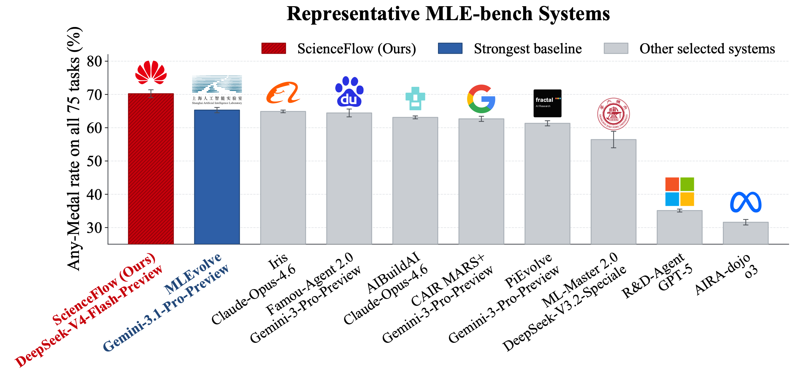

<h1 align="center">ScienceFlow</h1>

<p align="center"><b>An End-to-End Autoresearch Agent Framework</b></p>

<p align="center">
  <a href="https://www.noahlab.com.hk/news/212"><b>Project News</b></a>
  ·
  <a href="https://arxiv.org/abs/2608.14354"><b>Paper (arXiv)</b></a>
</p>

> [!IMPORTANT]
> **Testing preview.** This code line backs the public `preview` branch and is intended
> for evaluation, integration testing, and demonstrations. It includes TUI chat,
> multi-task long research, resume and recovery, resource coordination, and structured
> telemetry. Interfaces, configuration schemas, UI details, and workspace metadata may
> change before the stable release. Use the reviewed lock file and isolated workspaces,
> and do not rely on this preview for unattended production workloads.

ScienceFlow is an end-to-end autoresearch agent framework for productive, stable, and goal-aligned research over hours or days. It organizes research around recoverable executable workspaces, coupling persistent state, adaptive exploration, and evidence-aware execution control so agents can continue, redirect, or recover without losing validated progress.

ScienceFlow documentation uses **iqcraft** as the short name for InquiryCraft. Package,
import, and CLI examples continue to use the canonical `inquirycraft` name.

Across machine learning, scientific modeling, and mathematical optimization, ScienceFlow sustains effective long-horizon research and reaches **70.22 ± 1.18% Any-Medal** on the full 75-task MLE-bench within a 24-hour budget, exceeding the strongest reported baseline by **4.92 percentage points**.

<p align="center">
  
</p>
<p align="center"><sub><b>Figure 1a. Full MLE-bench Any-Medal leaderboard.</b> Mean ± SEM over three independent runs for ScienceFlow.</sub></p>

## Quick start

**Requirements:** Python 3.11+ and a model API endpoint. The current PyPI package is a
testing preview, so the examples pin its exact version.

Install the CLI in an isolated environment with
[`uv`](https://docs.astral.sh/uv/) (recommended):

```bash
uv tool install scienceflow==0.2.0b3
scienceflow --help
```

`pipx install scienceflow==0.2.0b3` is an equivalent alternative. On Debian and Ubuntu,
plain system-level `pip install` may be rejected as an `externally-managed-environment`
(PEP 668). This is expected: use `uv tool`, `pipx`, or a virtual environment instead of
`--break-system-packages`.

If neither tool is available, use Python's built-in virtual environment support:

```bash
python3 -m venv ~/.venvs/scienceflow
source ~/.venvs/scienceflow/bin/activate
python -m pip install --upgrade pip
python -m pip install scienceflow==0.2.0b3
```

Create the private model registry, edit the generated file, and start the TUI:

```bash
scienceflow config init
scienceflow config path
scienceflow tui --workspace "$PWD/sf_workspace"
```

The registry defaults to `~/.config/scienceflow/models.json` with mode `600`. API keys
are not copied into manifests, sessions, or reports. `scienceflow config path` prints the
active registry path; run `scienceflow tui --help` for workspace and resume options. Inside
the TUI, use `/long-research` to prepare and launch a managed research task.

## News

- **[2026-09]** The testing preview is available on the `preview` branch for integration testing and feedback.
- **[2026-08]** ScienceFlow is open source — the framework code, task packages, and documentation are available in this repository.
- **[2026-08]** The ScienceFlow paper is available on [arXiv](https://arxiv.org/abs/2608.14354).

## Core concepts

1. **Recoverable executable state.** Each persistent LNR worker advances research in an isolated executable workspace. An archived state binds that workspace to compact memory, validation evidence, and resource records.
2. **Stage Gate.** A task-specific result signal invokes `GateService`: the configured Evaluator produces normalized evidence, and the Gate policy decides admission. An accepted result materializes an immutable Stage with ledger facts and a recoverable workspace snapshot.
3. **ESTRA.** At a research boundary, Executable-State Transition through Re-Anchoring makes a two-axis decision: a start point (the current workspace or an archived Stage) and an intent (`continue` or `redirect`). Selecting an archived start point restores its executable state before the next research segment.
4. **Persistent memory.** Add records accepted Stage progress. Fold keeps recent, best-validated, and anchor-relevant evidence explicit while summarizing older records; Unfold/restore retrieves indexed evidence and state, and Assemble constructs the anchor-specific context for the next segment.
5. **Evidence-aware execution control.** Research workers choose scientific routes, while the controller admits, leases, monitors, timeboxes, and stops physical jobs using resource availability, remaining budget, validated progress, and recoverability. Valid worker states are finalized under `merge/finals/final_*`.

## System architecture

<p align="center">
  
</p>
<p align="center"><sub><b>Figure 2. ScienceFlow system architecture.</b> Research workers operate over recoverable executable states and adapt long-horizon trajectories through boundary-triggered ESTRA transitions, while evidence-aware execution control coordinates physical resource allocation and runtime execution.</sub></p>

## Development setup

For source development, create the environment from the reviewed lock file:

```bash
cd ScienceFlow
uv sync --python 3.12 --group dev
uv run scienceflow --help
```

The default command installs the Light development profile. Use
`uv sync --extra full --group dev` only when ML, GPU, MLE-bench, and scientific-design
dependencies are needed. The corresponding published Full profile can be installed inside
a virtual environment with:

```bash
python -m pip install "scienceflow[full]"==0.2.0b3
```

ScienceFlow embeds InquiryCraft `0.9.0` as its generic Agent Runtime; no second service is
required. Container and Compose usage lives in [`deploy/README.md`](deploy/README.md).

The same Stage Gate and Evaluator contract supports machine-learning engineering,
scientific modeling, and mathematical optimization. Registered task packages and their
evaluators live under [`tasks/`](tasks/).

## TUI and managed research

`scienceflow tui` starts a new chat session by default; add `--resume` to restore the latest
session for the same workspace. Ordinary text uses InquiryCraft's Agent Runtime. The main
ScienceFlow commands are:

| Command | Purpose |
|---|---|
| `/models` | Select the chat model and show the registry path. |
| `/long-research DESCRIPTION` | Prepare a task, confirm resources and models, preflight, and launch it. |
| `/tasks`, `/status N` | List tasks or inspect one persistent task number. |
| `/stop N`, `/resume N`, `/attach N` | Control or attach to a research task. |
| `/research-usage N`, `/resources` | Show model usage/cost or host and running-task resources. |
| `/web`, `/web stop` | Start or stop the workspace Web monitor. |

Closing the TUI detaches from supervised research; it does not stop workers. Chat cancellation
also does not stop research—use `/stop`. Managed-run records live under
`~/.local/state/scienceflow/managed_runs/`, while chat sessions live under
`<workspace>/.scienceflow/sessions/`.

`/resources` keeps each `starting` or `running` task on one line. Stopping tasks are hidden, but
their reservations remain excluded from `Available` until the processes release them.

The CLI exposes the same lifecycle when a full-screen terminal is not wanted:

```bash
scienceflow run circle-packing --tui --workspace /path/to/experiment
scienceflow status --all
scienceflow stop RUN_ID
scienceflow resume RUN_ID --tui
```

Do not resume a workspace with a different task profile, dataset, prompt, or artifact contract.
MLE-bench additionally requires the data root, `exp_id`, and `submission.csv` contract to agree.
Model pricing is optional and lives only in `models.<alias>.pricing`; missing prices display
`Cost —` rather than silently using a built-in estimate.

The Web monitor shows task status, workers, metric history, Stage lineage, ESTRA/EEC, usage,
and final reports for local and SSH-based runs.

## Verification

Run tests through the active development environment against the pinned, published
InquiryCraft `0.9.0` package:

```bash
.venv/bin/pytest -q \
  tests/test_inquirycraft_dependency_boundary.py \
  tests/test_inquirycraft_cli_composition.py \
  tests/test_long_research_interaction.py
```

The release workflow accepts only a version-matching tag, builds and checks the wheel and
source distribution, installs the wheel in a clean runner, and reruns the public dependency
contracts before publishing through PyPI Trusted Publishing. The full regression command is
`uv run --locked pytest -q`. Optional ML, GPU, MLE-bench, and scientific-design tests require
their corresponding extras.
