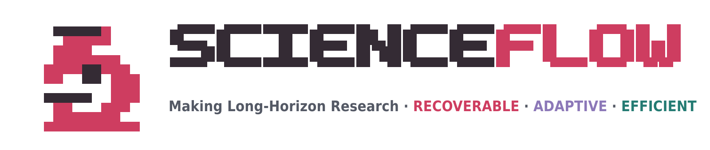

<p align="center">
  
</p>

<h1 align="left">ScienceFlow: your long-horizon AI research team</h1>

<p align="center">
  <a href="https://github.com/science-learner/ScienceFlow/actions/workflows/scienceflow-contract-ci.yml"></a>
  <a href="https://pypi.org/project/scienceflow/"></a>
  <a href="https://arxiv.org/abs/2608.14354"></a>
  <a href="https://github.com/science-learner/ScienceFlow/issues"></a>
  
</p>

ScienceFlow turns an executable task with a measurable objective into a managed research
process. Chat with the agent in the TUI, launch multiple long-running research tasks, inspect
their evidence and cost, and detach or resume without losing validated progress.

Use ScienceFlow when the task can run and be evaluated, but the best route to a stronger
result is still unknown. It supports machine-learning engineering, scientific modeling,
mathematical optimization, and custom evaluator-backed tasks.

> [!IMPORTANT]
> **Testing preview.** Interfaces, configuration, and workspace metadata may change before
> the stable release. Use isolated workspaces and review results before production use.

## Install

**Requirements:** Python 3.11+ and access to a supported model API.

Install the current preview as an isolated command-line application:

```bash
uv tool install scienceflow==0.2.0b3
scienceflow --help
```

`pipx install scienceflow==0.2.0b3` is an equivalent alternative. Debian and Ubuntu may
reject a system-level `pip install` with `externally-managed-environment` (PEP 668); use
`uv tool`, `pipx`, or a virtual environment instead of `--break-system-packages`.

Without `uv` or `pipx`:

```bash
python3 -m venv ~/.venvs/scienceflow
source ~/.venvs/scienceflow/bin/activate
python -m pip install --upgrade pip
python -m pip install scienceflow==0.2.0b3
```

## Start the TUI

Create the private model registry, edit the generated file, and open a workspace:

```bash
scienceflow config init
scienceflow config path
scienceflow tui --workspace "$PWD/sf_workspace"
```

The registry defaults to `~/.config/scienceflow/models.json` with mode `600`. API keys are
not copied into task manifests, sessions, or reports. Run `scienceflow tui --help` for model
configuration, workspace, and resume options. A redacted multi-endpoint example is available
at [`docs/examples/models.example.json`](docs/examples/models.example.json).

Ordinary text starts a normal agent conversation. Enter `/long-research` to select or define
a task, confirm workers and CPU/GPU limits, choose research models, run preflight checks, and
launch the task. Multiple tasks can continue in the same workspace while the TUI remains
available for chat and control.

## Operate research tasks

| TUI command | Purpose |
|---|---|
| `/long-research DESCRIPTION` | Prepare and launch another managed research task. |
| `/tasks`, `/status N` | List tasks or inspect one task. |
| `/stop N`, `/resume N`, `/attach N` | Stop, resume, or follow a task. |
| `/research-usage N`, `/resources` | Inspect model usage, cost, and allocated resources. |
| `/models` | Select the fixed chat model and inspect the model registry. |
| `/web`, `/web stop` | Start or stop the workspace Web monitor. |

Closing the TUI detaches from supervised research; it does not terminate workers. Chat
cancellation also leaves research running—use `/stop N` when the task itself should stop.
Return to the latest chat session with:

```bash
scienceflow tui --workspace "$PWD/sf_workspace" --resume
```

The same lifecycle is available without the full-screen TUI:

```bash
scienceflow status --all
scienceflow stop RUN_ID
scienceflow resume RUN_ID --tui
scienceflow web --workspace "$PWD/sf_workspace"
```

## What ScienceFlow provides

| Capability | What it does |
|---|---|
| Persistent research workers | Keep executable workspaces, evidence, memory, and runtime state together. |
| Parallel task management | Coordinate multiple tasks and workers with explicit CPU/GPU boundaries. |
| Stage Gate | Convert evaluator results into validated, recoverable research stages. |
| ESTRA | Continue the current route or re-anchor to a stronger archived state at research boundaries. |
| Evidence-aware control | Allocate, monitor, timebox, and stop physical work using progress and budget signals. |
| Resume and recovery | Restore chat sessions and research tasks without discarding accepted progress. |
| Structured telemetry | Record agent, tool, model, evaluator, resource, cost, and stage events for inspection. |
| TUI and Web monitor | Operate research interactively or follow workers, metrics, lineage, and final reports. |

## Your task and the runtime

| You provide | ScienceFlow manages |
|---|---|
| Objective, constraints, and metric direction | Research lifecycle and worker coordination |
| Executable task code and required data | Isolated workspaces and resource leases |
| Evaluator and valid artifact contract | Evidence normalization and Stage admission |
| Baseline or starting implementation | Exploration, recovery, selection, and finalization |

ScienceFlow does not invent a missing evaluator or silently replace required task data. A
registered `task.yaml` remains the source of truth for what is measured, which artifacts are
valid, and how results are admitted.

## How it works

<p align="center">
  
</p>

Each worker advances an executable workspace. Evaluators turn results into normalized
evidence, and accepted results become immutable Stages with recoverable snapshots. At a
research boundary, ESTRA chooses whether to continue or redirect and whether to start from
the current workspace or a validated archived Stage. Persistent memory and resource control
keep the next segment grounded in evidence and within the configured budget.

## Task environments

The base package provides the lightweight control plane and TUI. Install task-specific
dependencies only where they are needed:

```bash
python -m pip install "scienceflow[full]"==0.2.0b3
```

CPU and GPU allocations are task boundaries; ScienceFlow further divides CPU capacity across
workers. Model pricing is optional in `models.<alias>.pricing`; without it, the UI displays
`Cost —` instead of estimating silently. Do not resume a workspace with a different task,
dataset, evaluator, prompt, or artifact contract.

## Develop from source

```bash
git clone --branch preview https://github.com/science-learner/ScienceFlow.git
cd ScienceFlow
uv sync --python 3.12 --group dev
uv run scienceflow config init
uv run scienceflow tui --workspace "$PWD/sf_workspace"
```

Use `uv sync --extra full --group dev` only for tests that require the full ML/GPU task
environment. The source checkout and the published package use the same CLI and private
model registry.

Release-contract verification:

```bash
uv run --locked --group dev python -m pytest -q \
  tests/test_inquirycraft_dependency_boundary.py \
  tests/test_inquirycraft_cli_composition.py \
  tests/test_llm_system_message_compat.py \
  tests/test_workspace_contract_fixtures.py \
  tests/test_product_install_profiles.py
```

## Research background

ScienceFlow uses the same Stage Gate and evaluator contract across machine-learning
engineering, scientific modeling, and mathematical optimization. In the reported 24-hour
full 75-task MLE-bench evaluation, it reaches **70.22 ± 1.18% Any-Medal** over three runs.

<p align="center">
  
</p>

[Paper (arXiv)](https://arxiv.org/abs/2608.14354) ·
[Project news](https://www.noahlab.com.hk/news/212)

## Citation

If ScienceFlow supports your research, please cite the paper:

```bibtex
@misc{zhao2026scienceflow,
  title         = {{ScienceFlow}: A Long-Horizon Agent for {ML} Research, Scientific Discovery and Beyond},
  author        = {Mingming Zhao and Jiqian Dong and Kangping Xu and Zadid Hasan and Chengrui Fan and Shan Jiang and Shuai Mao and Yating Ling and Linyi Zou and Tailin Zhou and Yun Hin Chan and Wenkai Zhang and Zhanhong Zhou and Guowei Huang and Hongliang Li and Wenjing Cun and Zhitang Chen and Mingxuan Yuan and Yanhui Geng},
  year          = {2026},
  eprint        = {2608.14354},
  archivePrefix = {arXiv},
  primaryClass  = {cs.AI},
  doi           = {10.48550/arXiv.2608.14354},
  url           = {https://arxiv.org/abs/2608.14354}
}
```
